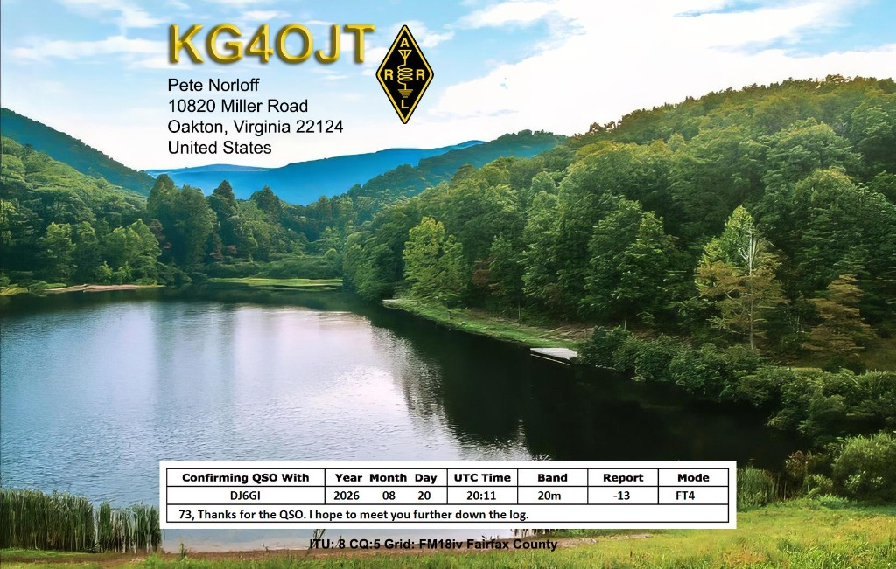

# AutoQSL - Automated QSL Card Designer & Email Dispatcher for macOS

**AutoQSL** is a native macOS application built with Swift and SwiftUI designed for amateur radio operators. It connects your digital loggers (**WSJT-X**, **JTDX**, **RUMlogNG**, and ADIF broadcasts) to an automated QSL card generation and email dispatch workflow with built-in **QRZ.com** lookup, a high-performance **SQLite database engine**, optional **iCloud Drive synchronization**, and a full-featured **visual QSL card designer**.



---

## Key Features

1. 📡 **Live UDP Capture & RUMlogNG AppleScript Grab**:
   - **WSJT-X / JTDX**: Automatically decodes binary broadcast packets (`QSOLogged` on port `2237` or `2239` / Multicast `224.0.0.1`).
   - **RUMlogNG**: Real-time ADIF UDP broadcast reception (port `12064` / `12060` / `2333`) with automatic `SUBMODE` (FT4/FT8) recognition.
   - **One-Click RUMlog Grab**: Instant AppleScript button (`Grab RUMlog`) to pull the latest QSO directly from RUMlogNG.
   - ⚠️ *Tip*: It is recommended to enable either WSJT-X or RUMlog UDP in AutoQSL depending on whether RUMlog forwards WSJT-X logs, avoiding duplicate entries.

2. 🔍 **QRZ.com XML API Integration**:
   - Automatically looks up DX callsigns to fetch the recipient's email address, full name, QTH address, and Maidenhead grid square.
   - Local in-memory caching to optimize requests and respect API limits.

3. 🎨 **Interactive Visual QSL Card Designer**:
   - WYSIWYG card canvas with customizable aspect ratios (Standard QSL `3.5" x 5.5" / 140x90mm`, `4" x 6"`, and `16:9`).
   - **Full Layer Management**: Callsign typography, custom text blocks, QSO data table grid, location footers, and badges/stickers.
   - **Opacity & Colors**: macOS native color picker with full alpha opacity channel support on all text, background tints, and element borders.
   - **Undo Support**: Full `⌘Z` keyboard shortcut and toolbar button for reversible design changes.
   - **Badges & Stickers**: ARRL Diamond, POTA, IOTA, SOTA, CQ WPX, WAS, plus custom transparent PNG badge imports.

4. ✉️ **Review & Automation Modes**:
   - **Preview & Confirm (Recommended)**: Presents a high-resolution preview dialog with recipient email and editable message before sending (`⌘+Return` to send, `Esc` to skip).
   - **Fully Automatic**: Dispatches immediately upon receiving a QSO without requiring user interaction. Perfect for hands-free contesting or FT8/FT4 operating.
   - **Manual Queue**: Holds incoming QSOs in the queue with a "Ready to Send" status for later batch review.
   - **Multi-Selection & Batch Actions**: Select multiple QSOs (`Shift + Arrow Keys` or `Cmd + Click`) to batch send or delete.
   - **Resizable UI**: Persistent divider positions (`NSSplitView`) and customizable window sizes across restarts.

5. 💾 **SQLite Database & iCloud Drive Sync**:
   - **macOS-Native SQLite (`autoqsl.sqlite`)**: High-speed, indexed database for instant searches and low memory usage even with 100,000+ QSOs.
   - **Dual Storage Options**: Switch between Local Storage (`~/Library/Application Support/AutoQSL`) and **iCloud Drive** (`iCloud Drive/AutoQSL`) for seamless multi-Mac synchronization.
   - **1-Click Data Migration**: Effortlessly copy or restore settings, templates, and QSO logs between local disk and iCloud.

6. 🚀 **High-Resolution Card Rendering & Flexible Email Delivery**:
   - Crisp 300 DPI rendering via SwiftUI `ImageRenderer`.
   - **Apple Mail Integration**: Sends directly through your macOS Apple Mail app in the background without needing SMTP server passwords.
   - **Default Mail Client Composer**: Opens your default email app composer (Mail, Outlook, Thunderbird, Spark, etc.) pre-filled with the QSL attachment.
   - **Direct SMTP Engine**: Native TLS/SSL SMTP socket engine supporting Gmail, iCloud, Outlook, and custom shack mail servers.

---

## How to Run AutoQSL

### Quick Start (Build & Launch)
```bash
./run.sh
```

### Run via Swift Package Manager
```bash
swift run AutoQSL
```

### Open in Xcode
```bash
open -a Xcode .
```

---

## Keyboard & Mouse Shortcuts

| Shortcut / Gesture | Description | Scope |
| :--- | :--- | :--- |
| `⌘,` | Open Settings | Global |
| `⌘?` | Open Help & Documentation | Global |
| `⌘1` / `⌘2` | Switch between QSO Queue and Card Designer | Global |
| `⇧⌘G` | Grab last QSO from RUMlogNG via AppleScript | Global |
| `⇧⌘K` | Simulate test QSO | Global |
| `⌘A` | Select all QSOs in Queue | QSO Queue |
| `⌘ + Click` / `⇧ + Click` | Multi-select / range-select QSOs | QSO Queue |
| `Delete` / `⌫` | Delete selected QSO(s) | QSO Queue |
| `Right-Click` | Context menu (Send, Callbook Lookup, Delete) | QSO Queue |
| `Click Callbook Icon` | Open QRZ / HamQTH in web browser | QSO Detail View |
| `⌘↩` (Cmd+Return) | Send QSL card in Confirmation Sheet | Confirmation Sheet |
| `Esc` | Skip / Dismiss modal sheets | Dialogs |
| `⌘Z` / `⇧⌘Z` | Undo / Redo design change | Card Designer |
| `Double-Click` | Direct inline text editing on canvas | Card Designer Canvas |

---

## Default Configuration

- **Callsign**: `DJ6GI` (Configurable under Station Profile)
- **WSJT-X UDP**: Port `2239` / Address `224.0.0.1` (Multicast)
- **RUMlogNG UDP**: Port `12064` / Address `127.0.0.1`
- **Storage**: SQLite (`autoqsl.sqlite`) + Dual Local / iCloud Drive
- **Delivery**: Apple Mail (Recommended for macOS)

---

## Changelog

### Version 1.3.0 (2026-08)
- ↔️ **Interactive Mouse Resizing**: Selected card elements display 6 corner and edge handles (`NW`, `NE`, `SW`, `SE`, `W`, `E`). Drag handles to scale stickers, adjust QSO table width, and resize typography/font sizes proportionally with live canvas preview.
- 🔍 **Pinch-to-Zoom & Dynamic Panning**: Fluid 2-finger trackpad pinch zooming (30%–250%) and 2D pan scrolling supported in the Card Designer, Customize Card modal editor, and Full-Size Inspection window.
- 🔎 **Full-Size Card Inspection & Floating Zoom**: Single-click on the card preview in either the QSO Detail view or the Confirmation Dialog opens an original size (100%) floating window (`1120×760 pt`) with trackpad pinch-to-zoom, pan scrolling, and zoom toolbar controls (`-`, `+`, `100%`, `Fit`, `Done`, `Esc`, `⌘+`, `⌘-`, `⌘0`).
- 💬 **Template Table Remarks & Per-QSO Override**: The greeting/remarks text configured in the Card Designer inspector serves as the standard template default on cards, while Edit QSO and Customize Card dialogs allow per-QSO overrides.
- ✏️ **Double-Click Inline Editing**: Direct on-canvas inline text editing activated via double-click without layout shift or position jumps.
- 🏷️ **Manual Status Assignment**: Right-click any single or multi-selected QSO in the queue to directly set its status (`Ready to Send`, `Awaiting Confirmation`, `Sent`, `Pending`, `Skipped`, `Failed`, `Failed: Email missing`).
- 🚫 **Failed: Email missing Status**: Dedicated status badge and icon for contacts where callbook lookup yielded no email address.
- 🎯 **Refined Awaiting Action Filter**: The "Awaiting Action" queue tab accurately groups `Pending`, `Ready to Send`, `Awaiting Confirmation`, and `Looking up QRZ` contacts.

### Version 1.2.0 (2026-08)
- 🛡️ **Badges & Stickers Collection**: Manageable collection of built-in (ARRL Diamond, POTA, IOTA, SOTA, CQ WPX/DX, WAS All States) and custom stickers with persistent storage in `stickers.json` and `Badges/`.
- ➕ **Add & Delete Stickers**: Import custom PNG, JPG, SVG, and WebP logos with custom display names; delete unwanted stickers from the collection on hover or via context menu.
- 📊 **Dynamic Confirmation Table**: Full real-time support for column visibility toggles (`QSO With`, `Date`, `UTC Time`, `Frequency/Band`, `RST`, `Mode`), custom column header labels, selectable frequency/band display modes (`MHz`, `Band`, `Band + Freq`), and greeting/remarks row.
- 📐 **Proportional Vector Scaling**: Fully scalable geometry-based vector graphics for all built-in badges to eliminate text clipping or overlapping at any size.
- 🎯 **True WYSIWYG Scale-Compensated Dragging**: Smooth, jump-free mouse dragging with exact canvas scale compensation.

### Version 1.1.0 (2026-08)
- 🔍 **HamQTH.com Callbook Lookup**: Full integration for free HamQTH XML callbook lookups with customizable priority (QRZ Primary + HamQTH Fallback, HamQTH Primary, QRZ Only, HamQTH Only).
- 🖱️ **Callbook Context Menu**: Right-click any queue entry to open the callsign in QRZ.com or HamQTH.com (whichever is configured) in the browser.
- ✅ **Native Queue Selection**: Single-click highlight with standard macOS selection colours; `⌘A` to select all; `⌘+click` / `Shift+click` for multi-select.
- 📡 **Improved RUMlogNG UDP Parsing**: N1MM XML contact format support (CDATA, 10 Hz frequency units, UTF-8/Latin-1 multi-encoding).
- 🔒 **Port Isolation**: Binds only explicitly configured UDP ports — no background fallback ports that could conflict with other apps.
- ⌨️ **Native Settings Shortcut**: Standard macOS `⌘,` shortcut across all app menus and active views.
- ✏️ **Direct On-Canvas Editing**: Edit Callsign, Address Block, and Custom Text directly on the interactive card canvas.
- 📻 **Band & Frequency Selection**: Dynamic two-way synchronization between Band and Frequency fields in Manual Log and Edit QSO dialogs.
- ⚡ **Auto Band Detection**: Frequency → band and band → frequency auto-populate.
- 🎛️ **Custom Modes & Bands**: Free-text mode entry for `VARAC`, `JT65`, `DMR`, `C4FM`, `D-STAR`, `WSPR`, etc.
- 💾 **SQLite Queue Synchronization**: Permanent deletion sync and protection against duplicate legacy re-imports.
- 🧪 **10/10 Unit Tests**: ADIF, RUMlog N1MM XML, WSJT-X binary, QRZ/HamQTH XML parsers, email template engine, and RadioUtils.

### Version 1.0.0 (2026-08)
- 🚀 Initial public release of AutoQSL for macOS.
- 📡 Real-time UDP capture from WSJT-X / JTDX / RUMlogNG and AppleScript instant QSO grab.
- 🔍 Automatic QRZ.com XML API lookup for recipient name, email, and QTH.
- 🎨 Interactive WYSIWYG QSL card designer with drag-and-drop layer positioning, undo (`⌘Z`), and badge overlays.
- ✉️ Multi-channel email dispatching via Apple Mail automation, default mail client, or direct SMTP.
- 💾 High-speed SQLite database engine (`autoqsl.sqlite`) and dual local / iCloud Drive synchronization.

---

## Author & Copyright

**AutoQSL**
Copyright © 2024–2026 Georg Isenbürger · DJ6GI
Crafted for the global amateur radio community.
